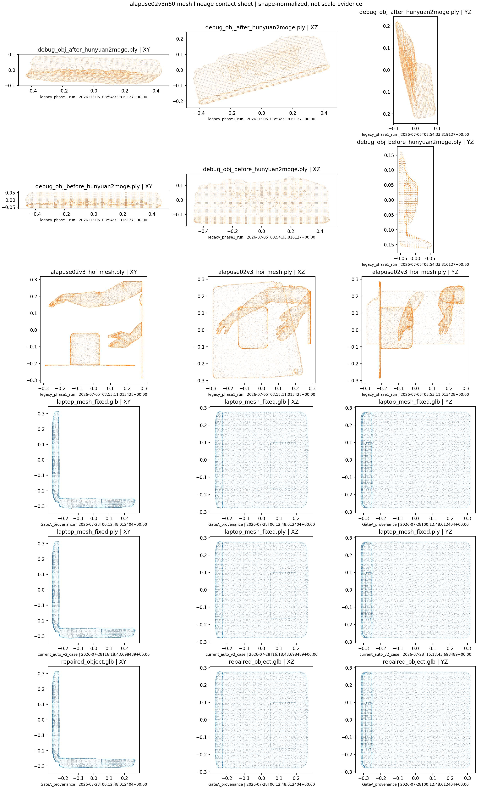

# `alapuse02v3n60` mesh lineage and transform ownership

## Accepted meshes

- `repaired_object.glb` is the clean Hunyuan-derived source produced by `c01_whole_minus_distractors.steps30.octree384.seed1234`.
- `gate0_accepted/laptop_mesh_fixed.glb` is byte-identical to that source (SHA-256 `e6a8522847fe8808f932c479c19f0d683f7afecbdf08f6cc4cddd08ead3c3a7a`).
- `gate0_accepted/laptop_mesh_fixed.ply` is the latest accepted working mesh (SHA-256 `95aadc9989cd7ee22acbe300c05c6e9cc40426d426c98350b768a9f2a46dc49f`). It owns the topology used by the object-only pipeline.

## Stale or illustration-only meshes

- `debug_obj_before_hunyuan2moge.ply` is a legacy pre-H2M diagnostic.
- `debug_obj_after_hunyuan2moge.ply` is a legacy post-H2M diagnostic.
- `hunyuan_hoi_out/alapuse02v3_hoi_mesh.ply` is rejected for source integration because it contains hands/arms, the stand/table, and mixed background geometry. It remains useful as a failure illustration.
- The old `h2m_transformations/alapuse02v3_hoi_mesh.npy` belongs to that contaminated source and must not be applied to the clean Gate-A mesh.

## Ownership rule

A transform is owned jointly by its exact source geometry and target frame. Matching a destination name such as “MoGe” is insufficient. The clean Gate-A branch requires a newly reviewed clean-object-to-MoGe transform.

## Current route

1. Prove GLB/PLY coordinate and topology continuity directly.
2. Bind the exact current laptop-only MoGe point support.
3. Fit bounded global CPU `Sim(3)` candidates while preserving topology and lid/base relation.
4. Review common-coordinate, RGB, contact, and penetration evidence.
5. Apply one accepted transform exactly once, capture step zero, run a short object-only stage, and only then enter joint flow.

## Illustration

The contact sheet normalizes each mesh independently. It documents semantic shape and contamination; it is not evidence of shared metric scale or translation.
